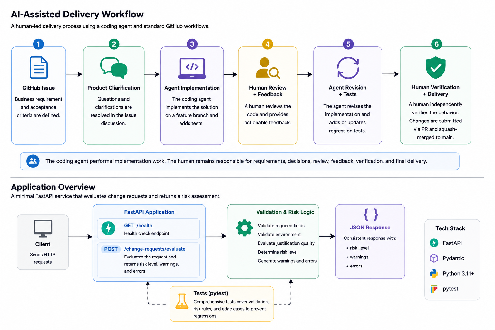

# Agentic Delivery Workflow

A practical example of AI-assisted software delivery using a coding agent inside a real GitHub repository.

This repository demonstrates a normal software-development workflow in which the coding agent performs implementation work while a human remains responsible for requirements, engineering decisions, review, correction, verification, and delivery.

## Visual overview

<p align="center">
  
</p>

This diagram summarizes both the human-led AI-assisted delivery workflow and the small FastAPI application implemented in this repository.

## Delivery workflow walkthrough

This repository demonstrates a complete AI-assisted software delivery cycle using normal GitHub development artifacts:

1. [Issue #1](https://github.com/j86schroeder/agentic-delivery-workflow/issues/1) — business requirement and acceptance criteria.
2. The Issue #1 discussion records product clarifications made before implementation.
3. [Pull Request #2](https://github.com/j86schroeder/agentic-delivery-workflow/pull/2) — initial implementation delivered on a feature branch.
4. The PR discussion records independent human review findings and the resulting corrective decision.
5. The implementation was revised with regression tests covering the review findings.
6. The corrected behavior was independently verified before merge.
7. The feature branch was squash-merged into `main`.

The coding agent performed implementation work, while the human remained responsible for requirements, product decisions, review, corrective feedback, independent verification, and final delivery.

## Start here

See GitHub Issue #1 for the initial business requirement and acceptance criteria.

## Example application: Change Request Risk API

A small FastAPI service that evaluates a proposed change request: whether it
contains enough information to review, and what level of risk it represents.

### Setup

```bash
python3 -m venv .venv
source .venv/bin/activate
pip install -r requirements.txt
```

### Running the API

```bash
uvicorn app.main:app --reload
```

The API is then available at `http://127.0.0.1:8000`, with interactive docs
at `http://127.0.0.1:8000/docs`.

### API usage

**Health check**

```bash
curl http://127.0.0.1:8000/health
```

```json
{"status": "ok"}
```

**Evaluate a change request**

```bash
curl -X POST http://127.0.0.1:8000/change-requests/evaluate \
  -H "Content-Type: application/json" \
  -d '{
    "change_type": "firewall",
    "environment": "production",
    "description": "Allow application servers to reach the vendor API",
    "business_justification": "Required for the new payment integration",
    "requested_by": "operations"
  }'
```

```json
{
  "valid": true,
  "risk_level": "high",
  "errors": [],
  "warnings": []
}
```

The endpoint always returns HTTP 200. Whether the request is well-formed and
how risky it is are both communicated in the response body, not the HTTP
status code — the request was still successfully *evaluated* even when it
turns out to be invalid. HTTP 422 is only returned if the request body isn't
valid JSON at all.

An invalid/incomplete request looks like this:

```bash
curl -X POST http://127.0.0.1:8000/change-requests/evaluate \
  -H "Content-Type: application/json" \
  -d '{
    "change_type": "firewall",
    "environment": "sandbox",
    "description": "",
    "business_justification": "asap",
    "requested_by": "ops"
  }'
```

```json
{
  "valid": false,
  "risk_level": "unknown",
  "errors": [
    "description is required",
    "environment 'sandbox' is not supported; must be one of: development, test, staging, production"
  ],
  "warnings": [
    "business_justification is weak: it has fewer than 20 non-whitespace characters or fewer than 4 words"
  ]
}
```

### Validation rules

A change request must include: `change_type`, `environment`, `description`,
`business_justification`, and `requested_by`.

- **Required fields**: any missing or blank field produces a validation
  error naming that field. All problems found are reported together in a
  single response, not just the first one encountered.
- **Environment**: must be one of `development`, `test`, `staging`,
  `production` (matched case-insensitively, with whitespace trimmed).
  Anything else produces a validation error.
- **Business justification**: a *missing or blank* justification is a
  validation error. A justification that is *present but weak* — fewer than
  20 non-whitespace characters, or fewer than 4 words — is reported as a
  warning rather than an error; the request can still be `valid`.

### Risk model

Baseline risk comes from the environment:

| Environment | Baseline risk |
|---|---|
| development | low |
| test | low |
| staging | medium |
| production | high |
| missing or unsupported | unknown |

A weak business justification raises a *known* baseline by one level (low →
medium, medium → high), capped at high. It does **not** turn an `unknown`
risk level into a known one — an unknown risk stays `unknown` regardless of
the justification. `change_type` does not affect the risk level — Issue #1
does not define change-type-specific risk rules.

A risk level is always returned, even for an invalid request. When the
environment is missing or unsupported there is no baseline to compute risk
from, so `risk_level` is `"unknown"` rather than being understated as
`"low"`.

### Testing

```bash
source .venv/bin/activate
pytest -v
```

Tests are API-level (via FastAPI's `TestClient`) and are organized one per
acceptance criterion from Issue #1: the health endpoint, required-field
validation, supported/unsupported environments, weak/missing business
justification, production-vs-non-production risk, the weak-justification
risk bump and its cap, an unknown environment's risk staying `"unknown"`
(including when combined with a weak justification), multiple validation
problems reported together, and
the shape of the response (`valid`, `risk_level`, `errors`, `warnings`).

### Design notes

- Validation and risk logic live in `app/risk.py` as plain functions,
  independent of the HTTP layer, to keep the implementation small and easy
  to follow.
- No database, authentication, frontend, or containers — per Issue #1's
  constraints.
